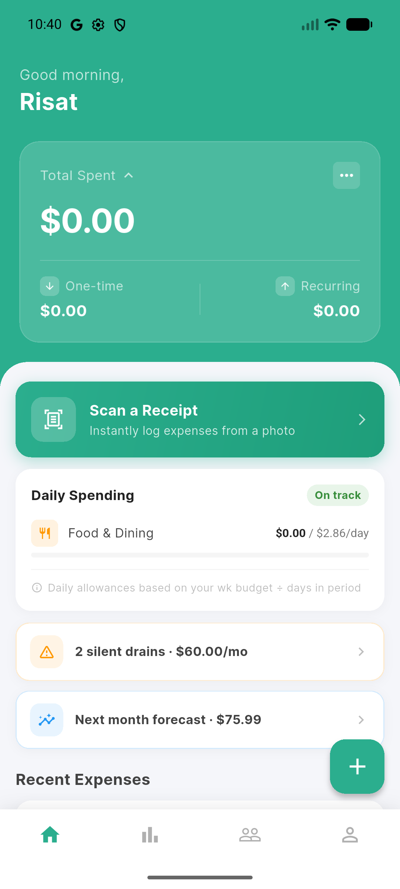
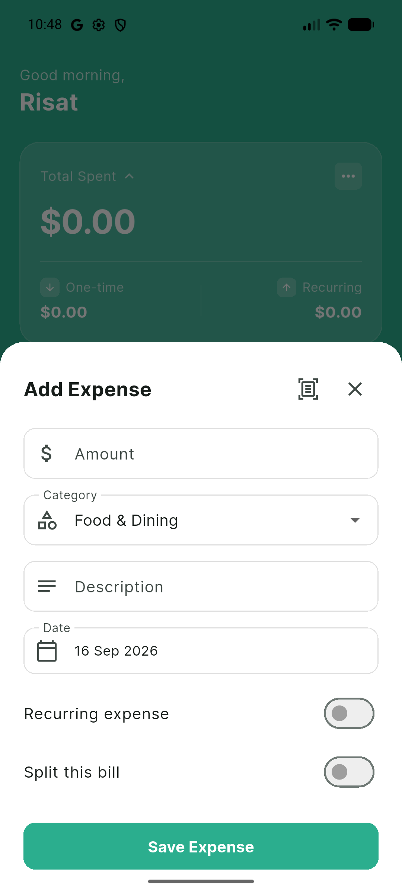
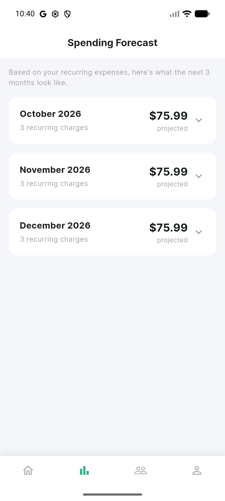
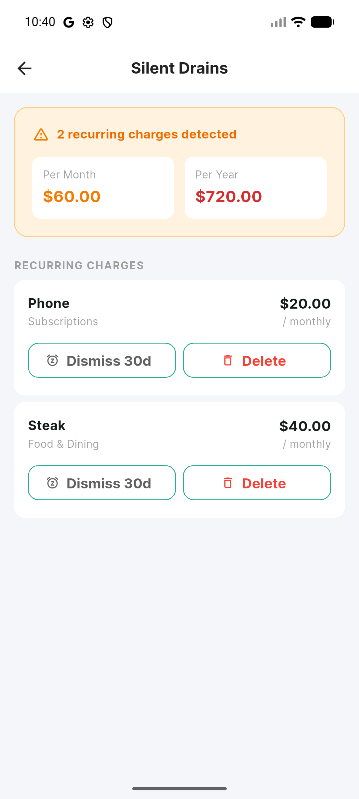
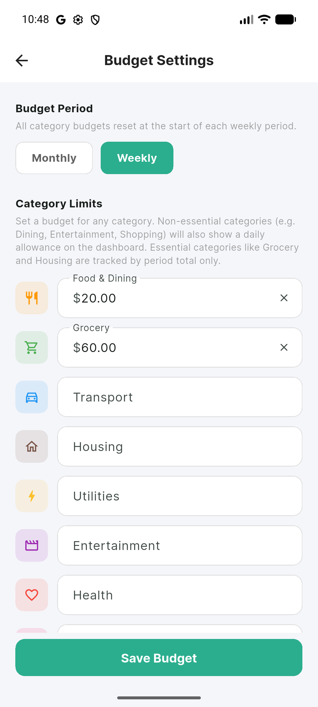
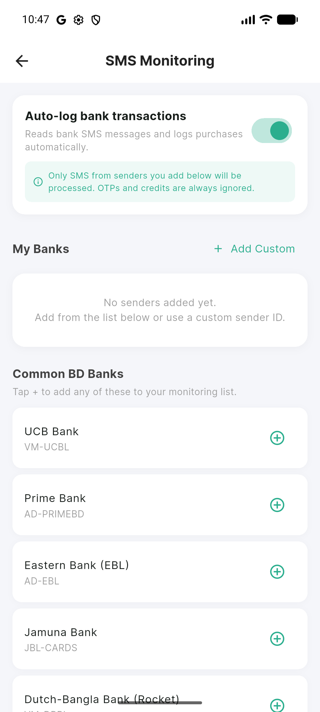
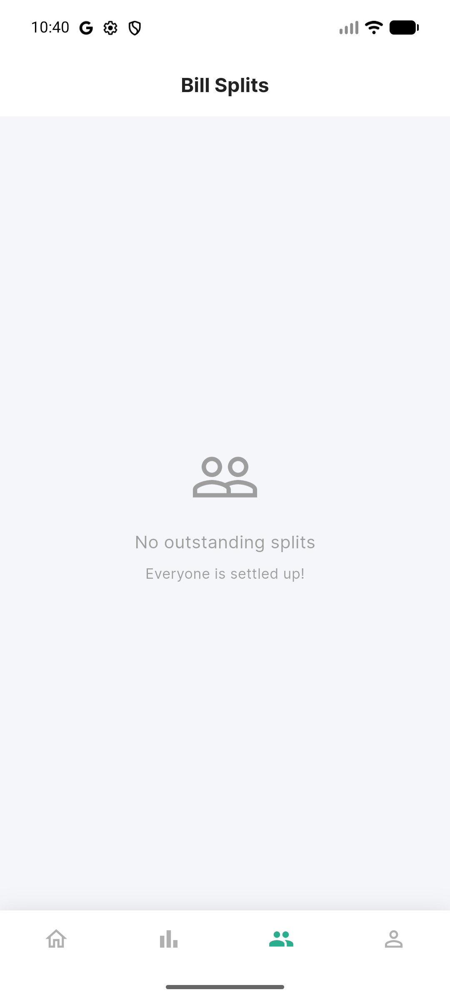
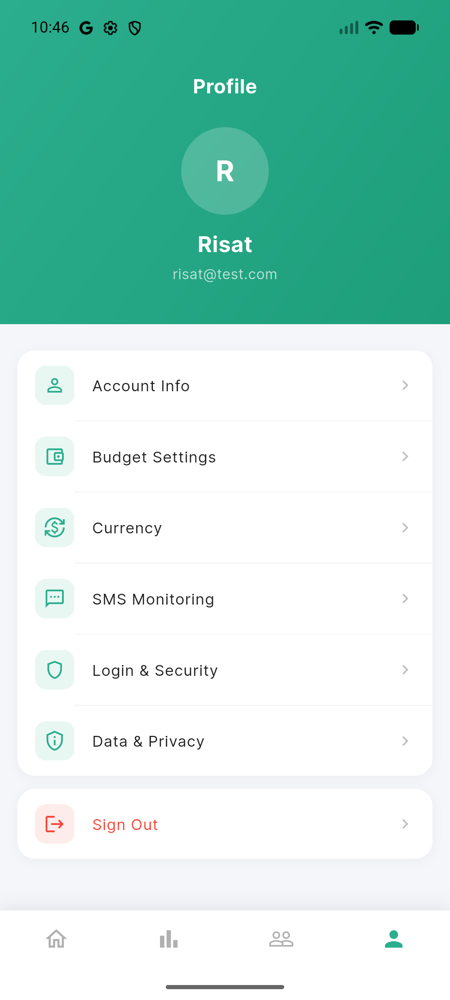

# WhereItWent — Personal Finance Tracker

A clean, offline-first Android app for tracking your spending, catching silent subscriptions, staying ahead of your finances, and automatically logging bank transactions from SMS alerts. Built with Flutter and Firebase.

---

## Screenshots

<p align="center">
  
  
  
  
</p>
<p align="center">
  
  
  
  
</p>

---

## Features

### Dashboard
- Live balance card showing one-time and recurring spend for the current period
- Daily spending card per non-essential category with allowance tracking and overspend flag
- Quick-access banners: Silent Drains alert and next-month forecast preview
- Recent expenses list with one-tap edit
- Scan a Receipt shortcut for OCR-powered expense entry

### Expense Tracking
- Add expenses with category, description, date, and amount
- Mark any expense as **recurring** (weekly / fortnightly / monthly)
- **Bill splitting** — attach named participants and track who still owes
- **OCR receipt scanning** — point your camera at a receipt to pre-fill amount and description automatically

### Bank SMS Auto-Detection 
- Background SMS listener detects Bangladeshi bank transaction alerts automatically
- Parses amount, merchant, date, and card number from real bank SMS formats (UCB, Prime Bank, EBL, Jamuna Bank, Dutch-Bangla, bKash, City Bank, BRAC, Islami Bank, MTB, SCB, HSBC)
- Auto-logs detected expenses to Firestore with smart category mapping
- Push notification shown when an expense is logged — tap to review
- OTPs, credits, reversals, and declined messages are always ignored
- Per-sender allowlist: you choose which bank SMS IDs are monitored
- Works even when the app is closed via native Android BroadcastReceiver

### Spending Forecast
- Projects the next 3 months of recurring charges
- Converts weekly and fortnightly charges to their monthly equivalents
- Expandable month cards showing each charge, amount, and recurrence frequency

### Silent Drains
- Automatically surfaces recurring expenses that have been active for 30+ days
- Shows true monthly and yearly cost so the impact is obvious
- Dismiss for 30 days or delete directly from the list

### Bill Splits
- Dedicated tab showing all outstanding splits across all expenses
- One-tap "Mark Settled" per person — state syncs to Firestore in real time

### Budget Settings
- Set limits per category (not a single overall total)
- Choose weekly or monthly reset period
- Daily allowance calculated automatically for non-essential categories

### Profile & Settings
- Account info and display name
- **Currency picker** — supports USD, BDT, AUD, GBP, EUR, CAD, SGD, INR
- Login & security (password change)
- Data & privacy controls
- Google Sign-In support

---

## Tech Stack

| Layer | Technology |
|---|---|
| Framework | Flutter 3.x (Android only, API 26+) |
| Language | Dart |
| State management | Riverpod 2 |
| Backend | Firebase Auth + Cloud Firestore |
| Auth | Email/password + Google Sign-In |
| OCR | Google ML Kit Text Recognition |
| SMS interception | Android BroadcastReceiver (Kotlin) + MethodChannel |
| Notifications | flutter_local_notifications |
| Permissions | permission_handler |
| Local storage | shared_preferences (SMS queue & sender allowlist) |
| Charts | fl_chart |
| Offline support | Firestore persistence (unlimited local cache) |

---

## Project Structure

```
finance_tracker_mobile_application/
└── lib/
    ├── core/               # Theme, constants, utility functions
    ├── models/             # Expense, Budget, BankSender, ParsedTransaction
    ├── providers/          # Riverpod providers (auth, expenses, budget, SMS, currency)
    ├── services/
    │   ├── expense_service.dart
    │   ├── budget_service.dart
    │   ├── drain_service.dart
    │   ├── forecast_service.dart
    │   ├── ocr_service.dart
    │   ├── bank_sms_parser.dart       # Regex parser for BD bank SMS formats
    │   ├── bank_sms_service.dart      # MethodChannel bridge + queue processor
    │   ├── bank_sender_service.dart   # Firestore CRUD + SharedPrefs sync
    │   └── notification_service.dart
    └── screens/
        ├── auth/           # Login & registration
        ├── onboarding/     # First-launch walkthrough
        ├── dashboard/      # Home screen and balance card
        ├── expenses/       # Add/edit expense sheet with OCR
        ├── forecast/       # 3-month recurring charge forecast
        ├── drains/         # Silent drains detector
        ├── splits/         # Bill splits tracker
        ├── profile/        # Profile, budget, currency, SMS monitoring, security
        └── shell/          # Bottom nav shell

android/app/src/main/kotlin/…/
├── MainActivity.kt          # MethodChannel: setEnabled, updateSenderAllowlist
└── BankSmsReceiver.kt       # BroadcastReceiver: queues SMS when app is closed
```

---

## Getting Started

### Prerequisites
- Flutter SDK `>=3.2.3`
- Android Studio or VS Code with the Flutter extension
- A Firebase project with **Authentication** and **Firestore** enabled
- Android device or emulator running API 26+

### Setup

1. Clone the repo
   ```bash
   git clone https://github.com/sajid9505/Finance-Project-with-Flutter.git
   cd Finance-Project-with-Flutter/finance_tracker_mobile_application
   ```

2. Install dependencies
   ```bash
   flutter pub get
   ```

3. Connect Firebase
   - Create a project in the [Firebase Console](https://console.firebase.google.com)
   - Add an Android app with package name `com.example.finance_tracker_mobile_application`
   - Download `google-services.json` and place it in `android/app/`
   - Enable **Email/Password** and **Google** sign-in under Authentication
   - Create a Firestore database (production mode)

4. Add Firestore security rules (see below)

5. Run
   ```bash
   flutter run
   ```

---

## Firestore Security Rules

Paste these in the Firebase Console under **Firestore → Rules**:

```
rules_version = '2';
service cloud.firestore {
  match /databases/{database}/documents {
    match /users/{userId} {
      allow read, write: if request.auth != null && request.auth.uid == userId;

      match /{document=**} {
        allow read, write: if request.auth != null && request.auth.uid == userId;
      }
    }
  }
}
```

---

## Testing

The project includes **138 unit and widget tests** covering all core logic:

```bash
flutter test
```

| Test file | Tests | What's covered |
|---|---|---|
| `test/bank_sms_parser_test.dart` | 39 | SMS parsing: skip rules, amounts, merchant, date, card number, category, 9 real-world samples |
| `test/models/expense_test.dart` | 24 | `SplitPerson`, `Expense.totalOwed`, `toFirestore`, categories, essential map |
| `test/models/budget_test.dart` | 13 | `Budget` round-trip, `hasCategoryBudgets`, `copyWith` |
| `test/models/bank_sender_test.dart` | 12 | `BankSender` serialization, preset banks list |
| `test/services/forecast_service_test.dart` | 16 | Forecast structure, filtering, amount conversion, sorting |
| `test/services/drain_service_test.dart` | 13 | `toMonthlyAmount` all intervals, `totalMonthlyCost` |
| `test/core/utils_test.dart` | 12 | `friendlyAuthError` all Firebase error codes |
| `test/widget_test.dart` | 9 | Category list, split states, budget labels, owed amount display |

---

## SMS Monitoring — How It Works

```
Incoming SMS (Android)
  └─ BankSmsReceiver.kt checks sender against allowlist in SharedPreferences
       ├─ App foreground → MethodChannel delivers SMS to Dart immediately
       └─ App background/killed → SMS body queued in SharedPreferences
            └─ Next app launch: BankSmsService.processPendingQueue()
                 └─ BankSmsParser.parse() → ParsedTransaction
                      └─ ExpenseService.addExpense() + push notification
```

Supported banks out of the box: UCB Bank, Prime Bank, Eastern Bank (EBL), Jamuna Bank, Dutch-Bangla Bank (Rocket), bKash, City Bank, BRAC Bank, Islami Bank, Mutual Trust Bank, Standard Chartered, HSBC Bangladesh. Custom sender IDs can be added manually.

---

## License

MIT
